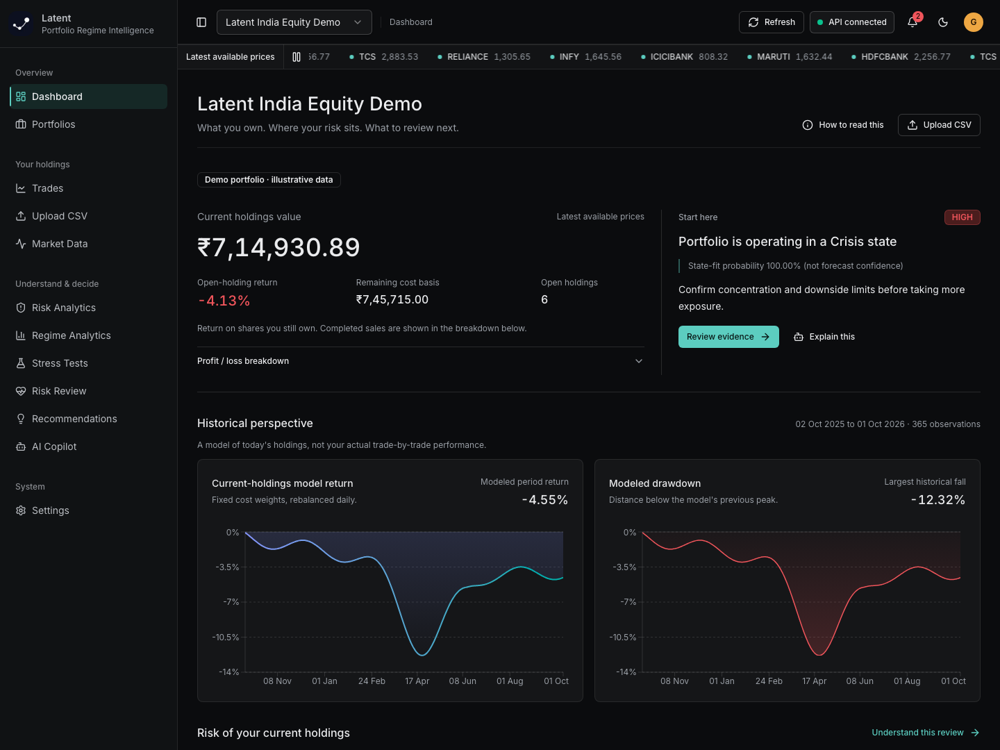
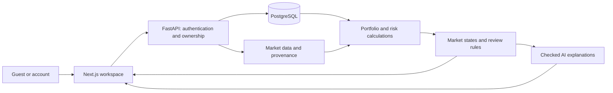

<picture>
  <source media="(prefers-color-scheme: dark)" srcset="frontend/public/brand/latent-header-dark.png">
  <source media="(prefers-color-scheme: light)" srcset="frontend/public/brand/latent-header-light.png">
  
</picture>

### Your portfolio has a value. It also has a story.

**Latent helps you understand what you own, where the risk sits, and what deserves a closer look.** Bring a trade CSV, or explore a demo portfolio. Move from a holdings summary to historical risk, changing market conditions, and an AI explanation grounded in the same numbers.

[See the experience](#a-portfolio-review-in-one-place) · [Try it locally](#run-latent) · [Read the project guide](docs/PROJECT_GUIDE.md) · [Explore the AI](#ai-that-explains-not-invents)

**Working MVP** · Indian-equity-first · Guest and account journeys · Desktop and mobile · Dark and light themes

---

## A Portfolio Review, in One Place

<picture>
  <source media="(prefers-color-scheme: dark)" srcset="docs/assets/dashboard-dark.png">
  <source media="(prefers-color-scheme: light)" srcset="docs/assets/dashboard-light.png">
  
</picture>

*Actual application screenshots, captured with the built-in demo in an isolated test environment. Prices and outcomes are illustrative, not live quotes or evidence of predictive accuracy. [Mobile view](docs/assets/dashboard-mobile.png).*

Most portfolio tools answer **"How much is it worth?"** Latent follows that with three more useful questions:

| Your question | Where Latent takes you |
| :--- | :--- |
| **What is driving my exposure?** | Sector allocation and the holdings that carry the most weight. |
| **What has this mix of holdings been sensitive to?** | Modeled return, drawdown, volatility, and downside-risk charts. |
| **What should I understand before acting?** | Prioritized review points, their supporting evidence, and a plain-language explanation. |

The goal is an informed review, not another screen of unexplained financial ratios.

## Start With a Question, Not a Setup Chore

1. **Explore first.** Continue as a guest or create an account to save your work.
2. **Bring a portfolio.** Upload a CSV, enter trades, or choose **Try Demo Portfolio**.
3. **Get your bearings.** See current holdings value, the return on shares still owned, and the most relevant review point.
4. **Investigate.** Inspect sector exposure, historical risk, market-state changes, or a stress scenario.
5. **Ask why.** Open Copilot from a metric or recommendation, inspect the evidence, and generate a report.

> **Demo walkthrough:** choose the demo, compare the holdings summary with the modeled-history charts, inspect the largest sector, then ask Copilot to explain the leading review point. No AI key is needed for the clearly labeled local explanation mode.

Guest access reduces signup friction; it is **not** a claim that nothing reaches the server. Guest credentials are tab-scoped, but portfolio data is temporarily backend-backed. [The exact session and cleanup behavior](docs/PROJECT_GUIDE.md#6-identity-ownership-and-guest-lifecycle) is documented.

## The Numbers Have Names for a Reason

Two honest numbers can answer different questions. Latent separates them instead of making them look interchangeable.

**Open-holding return** compares the value of shares you still own with their remaining purchase cost. **Modeled historical return** asks how a fixed, daily-rebalanced mix of today's holdings behaved across available price history. It is not your personal trade-by-trade performance.

For example, remaining cost of **INR 487,096.00** and current value of **INR 423,534.05** imply an open-holding return of **-13.05%**. A historical chart can legitimately end at a different percentage because it measures a different thing.

| What you see | What it does **not** mean |
| :--- | :--- |
| **A market-state probability** | A probability that tomorrow's market forecast is correct. |
| **A risk-review score** | A validated safety rating or a prediction of returns. |
| **A stress-test result** | A forecast; it is the result of the assumptions you confirmed. |
| **A missing value** | Zero. Incomplete pricing is surfaced instead of filled with purchase costs. |

[Read the formulas, worked examples, and limits](docs/PROJECT_GUIDE.md#9-the-calculation-contract).

## AI That Explains, Not Invents

Latent uses two distinct kinds of intelligence:

**A statistical model describes market conditions.** A Hidden Markov Model groups observed behavior into states such as Bull, Bear, High Volatility, or Crisis. If the model is unavailable, a labeled rules-based fallback avoids pretending to have statistical confidence.

**A language model helps explain the evidence.** Copilot does not calculate the portfolio or place trades. The server selects relevant facts, checks the model's structured response, and inserts the actual numbers itself.

```text
Your question
    -> authenticated portfolio facts
    -> small, locally ranked evidence set
    -> optional language-model explanation
    -> checked response + server-rendered figures + sources
```

- **Useful without a provider:** deterministic explanations and data-readiness checks remain available.
- **Bounded context:** local retrieval, limited conversation history, and an output-token cap reduce unnecessary model input and output.
- **Visible provenance:** responses identify provider, local, or fallback mode and cite backend facts.
- **Limited authority:** the model has no trading, database-write, shell, or browsing tools.
- **Private credentials:** managed NVIDIA credentials stay on the server; optional user-supplied keys live in page memory, not browser storage.

These are safeguards, not a guarantee against every misleading interpretation. Retrieval uses local lexical hashing, not a semantic vector database. Predictive accuracy and live-provider answer quality still need independent evaluation.

[Follow one question through the AI system](docs/PROJECT_GUIDE.md#12-the-ai-system-end-to-end).

## Built Around Deliberate Choices

**Let people reach value before signing up.** Guest mode, CSV-first onboarding, and a resettable demo make the product inspectable without an existing account or perfect input file.

**Keep a number traceable.** The dashboard, risk review, recommendations, and Copilot share backend calculations. Units and methodology are part of the experience, not hidden implementation details.

**Make failure understandable.** CSV repair proposes deterministic corrections; data gaps, stale prices, unavailable analytics, and AI fallbacks are disclosed. A degraded dependency should not masquerade as a confident answer.

**Give the next action a reason.** Recommendations carry evidence and a review action. The application supports understanding; it does not execute investment decisions.

The [business-first project guide](docs/PROJECT_GUIDE.md#1-the-business-case) explains the audience, product tradeoffs, proposed success metrics, and what still needs user research.

## Under the Surface



| Layer | Implementation |
| :--- | :--- |
| Experience | Next.js, React, TypeScript, shadcn/ui, Tailwind, Recharts, TanStack Query |
| API and storage | FastAPI, Pydantic, SQLAlchemy, Alembic, PostgreSQL |
| Analytics | pandas, NumPy, scikit-learn, hmmlearn |
| AI | LangChain, local fact retrieval, provider adapters, checked output schemas |
| Verification | pytest, Playwright, type checks, dependency audits, GitHub Actions |

## Run Latent

Use **Python 3.12**, **Node.js 22**, and PostgreSQL. Choose either Docker for the local database or a managed PostgreSQL connection. You do not need Docker if your database is already hosted.

From the repository root, on a fresh checkout:

```bash
python3.12 -m venv venv
source venv/bin/activate
pip install -r requirements-dev.txt
npm --prefix frontend ci

cp .env.example .env
cp frontend/.env.example frontend/.env.local
openssl rand -hex 32
```

**Before starting:** put the generated secret in `.env` as `AUTH_SECRET_KEY`, and configure the database. Keep existing `.env` files if this is not a fresh checkout. Never commit real secrets. [Local PostgreSQL and Neon setup](docs/PROJECT_GUIDE.md#16-run-deploy-and-operate).

```bash
./scripts/dev
```

Open the printed frontend URL, normally **http://localhost:3000/login**. The launcher applies migrations, starts both services, and selects alternative ports if needed. Use the same browser hostname consistently for cookie authentication.

For a presentation, prepare an optimized frontend before your audience arrives:

```bash
./scripts/dev --demo
```

This builds the frontend and disables development reloaders. It **does not** switch databases, seed data automatically, or eliminate hosting/provider cold starts. Choose **Try Demo Portfolio** in the app, or import [sample_portfolio_trades.csv](testing/sample_portfolio_trades.csv).

<details>
<summary><strong>Verification commands</strong></summary>

```bash
# Backend: from the repository root, with the venv active
pytest -q
python scripts/check_secrets.py

# Frontend
cd frontend
npm run check
npx playwright install chromium
npm run test:e2e
```

The browser tests use a temporary SQLite database and deterministic test market data, not your Neon database. Ensure ports 3010 and 8010 are free: the local Playwright configuration can reuse existing servers.

`./scripts/release-check` runs the combined local release checks. The CI workflow additionally exercises PostgreSQL migrations and readiness. Passing either is not proof of forecast accuracy or a completed production deployment.

</details>

## Where the Project Stands

**Implemented:** the guest/account journey, CSV validation and repair, trade accounting, portfolio views, risk analytics, regime analysis, review rules, confirmed stress tests, Copilot, and saved reports.

**Still to prove before a dependable public release:** staged deployment and recovery, account-recovery email, live-provider reliability and spending limits, market-data completeness and licensing, load behavior, and independent model evaluation. The guide includes concrete acceptance criteria, not just a feature wishlist.

This is an educational decision-support MVP, **not investment advice, a brokerage, or a validated forecasting service**. There is no claimed accuracy percentage, uptime SLA, or guarantee of free hosting.

---

### Read Further

**[The Latent Project Guide](docs/PROJECT_GUIDE.md)**: business case, journey, architecture, all database tables, calculations, AI, edge cases, setup, deployment, and production priorities.

[AI engineering notes](docs/ai-engineering.md) · [Security boundaries](SECURITY.md) · [Backend tests](tests) · [Browser journeys](frontend/e2e) · [CI workflow](.github/workflows/ci.yml)

*Understand the exposure. Inspect the evidence. Make the decision yourself.*
