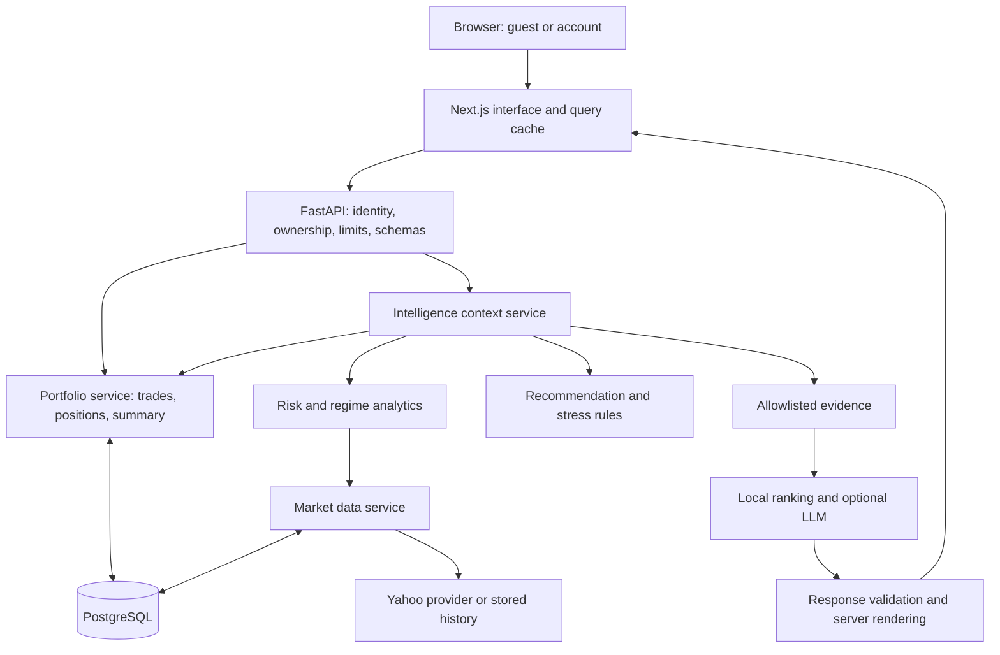
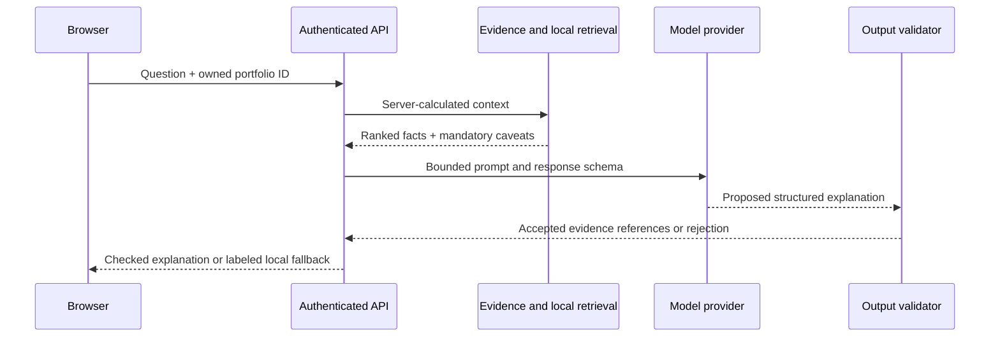
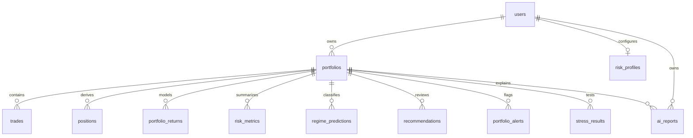

# Latent: The Project Guide

## From a Trade File to an Informed Portfolio Review

**Business case. Product decisions. Calculations. Architecture. AI. Operational reality.**

**Reviewed:** 1 October 2026. **Scope:** the current working tree, including uncommitted improvements. This is a source-grounded explanation of the application, not a certification of a live deployment, a security audit, or a claim of investment performance. Implementation links are relative to this repository so readers can inspect the evidence.

**In one sentence:** Latent turns a portfolio's trade history into a connected review of holdings, historical risk, market conditions, and evidence-backed explanations.

**The central promise:** help someone understand a portfolio before deciding what to do. The application does not place trades, guarantee outcomes, or know whether tomorrow's market will rise.

[Back to the visual introduction](../README.md)

### Reading Routes

- **Product or business reviewer:** start with sections 1-4, then the production priorities in section 18.
- **Engineer joining the project:** follow sections 5-11, 13-17, and the source map.
- **AI engineer or evaluator:** read sections 10 and 12, then the evaluation and release gates.
- **Presenter:** use the demo in section 4 and the setup in section 16. Do not describe illustrative prices as live results.

### Contents

1. [The business case](#1-the-business-case)
2. [Product decisions and tradeoffs](#2-product-decisions-and-tradeoffs)
3. [How success should be measured](#3-how-success-should-be-measured)
4. [The complete user journey](#4-the-complete-user-journey)
5. [System architecture](#5-system-architecture)
6. [Identity, ownership, and guest lifecycle](#6-identity-ownership-and-guest-lifecycle)
7. [CSV import and trade accounting](#7-csv-import-and-trade-accounting)
8. [Market data and provenance](#8-market-data-and-provenance)
9. [The calculation contract](#9-the-calculation-contract)
10. [Market-regime modeling and validation](#10-market-regime-modeling-and-validation)
11. [Recommendations, preferences, and stress tests](#11-recommendations-preferences-and-stress-tests)
12. [The AI system, end to end](#12-the-ai-system-end-to-end)
13. [Database and API reference](#13-database-and-api-reference)
14. [Edge cases and failure recovery](#14-edge-cases-and-failure-recovery)
15. [Frontend structure and performance](#15-frontend-structure-and-performance)
16. [Run, deploy, and operate](#16-run-deploy-and-operate)
17. [Testing and evidence](#17-testing-and-evidence)
18. [What remains before production](#18-what-remains-before-production)
19. [Source map and glossary](#19-source-map-and-glossary)

---

## 1. The Business Case

### The Problem

A portfolio value is easy to read. A portfolio's risks are harder to connect.

A person can own several stocks and still depend heavily on one industry. A profitable holding can have a difficult loss history. A familiar market environment can change. A dashboard can display all of these facts and still leave the reader asking, "Which of this matters to me?"

Latent addresses that interpretation gap. It combines holdings, market history, exposure, and explanation in one review workflow. Its value is not the number of charts. Its value is helping the reader move from a number to a reason and an appropriate next question.

### Intended Audience

The current product is best understood as an **Indian-equity-first educational decision-support MVP** for self-directed investors and people learning portfolio analysis. CSV entry and common NSE/BSE symbol handling fit that starting point.

It is also a demonstrable product/engineering portfolio project: it exposes choices about activation, numerical trust, graceful failure, privacy, and bounded AI. Those are engineering and product decisions a reviewer can inspect, rather than claims based only on screenshots.

This positioning is a **product hypothesis**, not a finding from completed customer research. The repository does not establish paid demand, customer retention, user interview results, or a validated target segment.

### The Job to Be Done

> When I review my investments, help me see where my exposure and downside come from, explain what the evidence means, and show what deserves investigation without making me learn every financial term first.

The desired user outcome is an informed review. It is not more trades, more time spent in the app, or unquestioning acceptance of an AI answer.

### Scope and Non-Goals

**In scope:** guest/account access, CSV validation, trade entry, long-only positions, single-currency valuation, historical risk, sector exposure, market-state classification, review rules, confirmed sensitivity scenarios, explanations, and reports.

**Not implemented as a complete product:** broker synchronization, execution, personalized regulated investment advice, short selling, a cash ledger, multicurrency FX accounting, dividend/corporate-action accounting, tax reporting, or validated return forecasting.

### A Plausible Product Direction

A free exploration experience could lead to saved research workspaces, repeat reviews, or richer reporting. That is a possible direction, not an existing subscription business. There is no billing implementation or evidence of willingness to pay in this repository.

Before adding paid features, validate whether people can correctly explain their largest exposure and distinguish observed holdings returns from modeled history. A subscription model is premature if the underlying understanding is not reliable.

## 2. Product Decisions and Tradeoffs

### Guest Before Commitment

**Decision:** let someone enter without registration and put CSV import and a demo within immediate reach.

**Benefit:** less setup before the user can inspect value. **Cost:** temporary backend data, session limits, cleanup requirements, and a need to explain that guest work is not durable.

Do not promise immediate deletion on tab close. The actual retention behavior is in section 6.

### Explain the First Dashboard in Layers

The first dashboard follows this order:

1. What the current holdings are worth.
2. Their return against remaining cost, with a separate profit/loss breakdown.
3. A prioritized review point and its evidence.
4. Modeled history, risk indicators, sector allocation, and leading positions.

An expandable breakdown keeps realized/unrealized details available without crowding the first impression. Metric explanations and the introductory guide provide additional context without making the user read a manual first.

This is a deliberate distinction between **progressive disclosure** and hiding important caveats. The modeled-history disclaimer must remain visible even when deeper explanation is collapsed.

### Put Calculation Before Language Generation

**Decision:** deterministic backend code owns financial values; the language model interprets selected evidence.

**Benefit:** an explanation cannot silently become a second calculation engine. **Cost:** stricter structured responses may be rejected more often, leading to a local fallback. That rejection rate should be measured rather than disguised.

### Prefer an Honest Gap to a Complete-Looking Screen

Missing prices are not replaced by purchase prices. Missing risk evidence does not produce a reassuring score. Rules-based regime fallback does not invent a probability. These choices can make the interface look less complete, but protect its meaning.

### Build a Demo Without Depending on Live Markets

The built-in demo creates six Indian-equity holdings, generated price history, and attempts analytics preparation using a stored-data-only provider. It can be reset. It is a product demonstration, not a market backtest.

Generated demo rows are tagged `data_source="demo"`; ordinary portfolios exclude those rows from valuation/history. Demo and real prices currently share a table keyed by ticker/date, so stronger dataset isolation remains a production improvement. Existing real rows are not overwritten by demo seeding.

## 3. How Success Should Be Measured

**The following is a proposed measurement plan. These are not measured achievements or an implemented analytics dashboard.**

A useful north-star candidate is **completed, understood portfolio reviews**, not chat messages generated. Instrument completion separately from understanding: clicking a button cannot prove comprehension.

| Question | Proposed measure | Definition |
| :--- | :--- | :--- |
| Can visitors reach value? | Activation rate | Sessions reaching a usable dashboard divided by eligible guest/account sessions. |
| Is onboarding easy? | Import completion | Successful saves divided by valid-file import attempts; separate validation failures. |
| Is the wait acceptable? | Time to first useful view | Session entry to visible valued holdings and an explanation of data availability; track p50/p95. |
| Do users understand the result? | Comprehension check | Can a participant distinguish holdings return, modeled return, and regime confidence? |
| Are recommendations useful? | Evidence-review rate | Sessions opening evidence for a recommendation, paired with qualitative usefulness feedback. |
| Is AI dependable? | Grounded-answer acceptance | Schema/evidence-valid provider responses divided by provider attempts; report fallback rate separately. |
| Does the product earn repeat use? | Return review rate | Account users completing another review within a defined interval; not guest-session resurrection. |

**Guardrails:** no cross-user access, no missing-to-zero metric substitutions, no fabricated quotations, no undisclosed fallback, bounded provider spending, and a clear distinction between stale data and unavailable data.

Suggested event names include `guest_started`, `csv_preview_completed`, `csv_import_succeeded`, `dashboard_ready`, `evidence_opened`, `copilot_completed`, and `report_created`. Store status, timing, and coarse counts, not raw CSV content, portfolio values, credentials, or full prompts by default. Consent and retention policy need to precede public instrumentation.

**Research before expansion:** run task-based sessions with a small group of target users. Ask them to import a file, identify their largest sector, explain one risk measure in their own words, and recognize an unavailable result. Record misunderstanding and abandonment, not just visual preference.

## 4. The Complete User Journey

### Entry and First Value

The onboarding screen offers account authentication and guest entry. A new guest reaches CSV onboarding. The user can import a file, create a portfolio, or choose the demo. The distinction between a selected file, a validated file, and a completed import is important: selection alone does not save trades.

| Screen | User's question | Useful next step |
| :--- | :--- | :--- |
| Onboarding/auth | Can I explore before registering? | Guest, demo, or account. |
| Upload CSV | Has my file actually been saved? | Preview/repair, import, then open the dashboard. |
| Portfolios | Which collection am I reviewing? | Select, create, edit, or delete a portfolio. |
| Trades | Are these the transactions I intended? | Inspect or correct the ledger. |
| Dashboard | What matters first? | Review the headline, history, exposure, and leading concern. |
| Market Data | Which observations support the analysis? | Inspect available history and data gaps. |
| Risk Analytics | How variable and loss-prone is the modeled basket? | Read charts and metric explanations. |
| Regime Analytics | What observed market state fits the data? | Inspect history, drivers, model mode, and probability limits. |
| Stress Tests | What happens under a stated shock? | Review assumptions, confirm, then compare values. |
| Risk Review | Why did the score move? | Inspect components and evidence sufficiency. |
| Recommendations | What should I review next, and why? | Read supporting evidence or ask Copilot. |
| AI Copilot | Can this be explained in plain language? | Ask, inspect sources, check data, or generate a report. |
| Settings | Do the review limits reflect my preferences? | Update risk tolerance and related preferences. |

### A Presenter-Friendly Walkthrough

1. Start the optimized local presentation mode described in section 16.
2. Enter as a guest and choose **Try Demo Portfolio**. Explicitly introduce the values as illustrative.
3. Read the current-holdings headline. Open the profit/loss breakdown.
4. Contrast the holdings return with the separately labeled historical model chart.
5. Select a sector and inspect the leading holdings behind it.
6. Open a review point and ask Copilot to explain its evidence.
7. Show the source/mode disclosure; demonstrate local mode if no provider is configured.
8. End with one honest limitation and the next validation step.

The stronger presentation is not "AI predicts the market." It is "This system connects data, calculation, and explanation while making uncertainty visible."

### UX Acceptance Criteria

At desktop and mobile widths, users should reach login and guest controls, select a file, identify import completion, read exact figures without clipping, and navigate without horizontal page overflow. Chart tooltips supplement visible labels; color alone should not carry the entire meaning. Dark/light themes and reduced-motion behavior need continuing regression checks.

## 5. System Architecture

### The Active Application

The current web application is **Next.js + FastAPI**, not the older Streamlit/research entrypoint. Route files in `frontend/src/app` delegate to feature modules. API routes validate requests and delegate to domain services. SQLAlchemy owns database access; Alembic owns schema changes.



### One Portfolio Read, End to End

1. The browser requests portfolio intelligence for the selected portfolio ID.
2. FastAPI verifies the caller and the portfolio's owner before retrieving cached analytics.
3. The context service uses a short-lived analytics snapshot keyed by database namespace, portfolio ID, and portfolio revision.
4. On a miss, it builds risk and regime results. Optional failures become warnings instead of deleting the available portfolio summary.
5. Positions are revalued from the completed stored-price fetch. The summary, sector allocation, and profile are assembled.
6. Recommendations and explanations derive from that context.
7. Typed frontend adapters preserve the numeric contract; components format values and draw charts.

This centralizes **meaning**, not necessarily one immutable transaction-wide snapshot. External price refreshes, process-local caches, and concurrent writes still need stronger versioning for scaled deployment.

### What Lives Where

- `frontend/src/features`: page-level product workflows.
- `frontend/src/components`: shadcn primitives, charts, common states, authentication, and the application shell.
- `frontend/src/lib`: API clients, adapters, query keys, identity state, portfolio selection, types, and number formatting.
- `src/portfolio`: active CSV import, trade accounting, portfolio ownership, valuation, and demo service.
- `src/market`: providers, cache, persistence, metadata classification, validation, and feature inputs.
- `src/analytics`: active risk, returns, regime orchestration, and review scoring.
- `src/intelligence`: unified context, profiles, recommendations, alerts, explanations, and stress tests.
- `src/ai`: evidence projection, local retrieval, provider adapters, and output safety.
- `src/database` and `migrations`: schema, sessions, upserts, and migration history.

Some older modules under `src/risk`, `src/portfolio`, the root `app.py`, and research scripts remain useful reference material but are not interchangeable with the active API service contract. Follow imports from `src/api/routes` before deciding which calculation to change.

## 6. Identity, Ownership, and Guest Lifecycle

### Account Authentication

Signup normalizes the email, checks uniqueness, hashes the password, creates a user, and issues a signed token. Login uses a generic invalid-credentials response and a dummy password hash on missing accounts to reduce obvious account-enumeration differences.

Passwords use **PBKDF2-HMAC-SHA256**, a random salt, and 260,000 iterations in the current implementation. Token signing is a repository implementation of **HS256**; expiry, signature, user activity, guest/account identity, and a stored token version are checked.

Account browser authentication uses an **HttpOnly cookie**. The frontend stores user metadata, not the account token, in session storage or local storage depending on remembered login. The auth API response also contains an `access_token` field, so it would be inaccurate to claim account tokens can never appear in a JavaScript-readable response.

Remembered login changes cookie persistence; it does not save the password. Defaults are a 24-hour account token and a 12-hour guest token. Logout increments `users.token_version`, invalidating existing tokens for that account across sessions, and clears the cookie. There is no complete refresh-token/session-device management system.

### Authorization Is Separate

A hidden page link is not access control. Protected API operations verify that the portfolio belongs to the authenticated user. Trades, positions, recommendations, reports, and stress operations must remain inside that ownership scope.

The frontend route guard improves the journey, while the backend enforces access. Database row-level security is not configured by this schema; application ownership checks are therefore a critical boundary.

### Guest Behavior, Precisely

Guest login creates a temporary backend user and returns a bearer token. The frontend stores the guest identity/token in `sessionStorage`, not an account cookie. Guest portfolios and derived records are stored in the backend database under that user's ownership.

Explicit guest logout attempts server-side deletion and then clears local state. A background maintenance job removes guest users older than `GUEST_DATA_RETENTION_HOURS`, default **24 hours**, with a default **one-hour** maintenance interval and an immediate run at application startup.

**Closing the tab is not a reliable server event.** Normal tab closure removes normal session storage, but browser restore/duplication behavior can preserve or copy it. An issued token can remain valid until expiry or deletion. Backend cleanup also requires the maintenance process to run; a sleeping host can delay it. Guest age is measured from account creation, not continuous activity.

The accurate product wording is "temporary, tab-scoped access with scheduled backend cleanup," not "all data vanishes instantly when the tab closes."

### Remaining Identity Work

Email verification, password-reset delivery, MFA, device-session controls, and recovery support are not complete. Before broad public account use, implement recovery and test logout/revocation across tabs, outages, proxies, and deployments. A vetted authentication library and explicit token issuer/audience/key-rotation strategy would reduce maintenance risk.

Sources: [auth routes](../src/api/routes/auth.py), [security](../src/auth/security.py), [dependencies](../src/api/dependencies.py), [lifecycle](../src/auth/lifecycle.py), [browser identity](../frontend/src/lib/auth.tsx).

## 7. CSV Import and Trade Accounting

### The Input Contract

The canonical CSV needs `ticker`, `quantity`, `price`, and `transaction_date`. `transaction_type` should be explicit for a mixed buy/sell ledger; when absent it defaults to `BUY`. Optional fields include `broker`, `fees`, `taxes`, `currency`, and `notes`.

Current defaults for missing fields are INR currency and zero fees/taxes. Those are defaults, not facts inferred from a broker. The user must verify them, especially for another currency or a source that omits charges.

```csv
ticker,transaction_type,quantity,price,transaction_date,fees,taxes,currency
INFY.NS,BUY,10,1500,2026-01-15,20,0,INR
INFY.NS,SELL,2,1600,2026-02-16,10,0,INR
```

Use the [sample trade file](../testing/sample_portfolio_trades.csv) for a broader exercise. The example above is illustrative transaction input, not historical market evidence.

### Preview, Repair, Commit

**Preview** parses the file, normalizes known column aliases, identifies errors/warnings, and returns a report. It does not establish that the portfolio has been imported.

**Resolve** applies deterministic repairs: recognized header mappings, ticker normalization, supported action aliases, removal of currency/thousands formatting from numbers, and supported date conversions. It returns a new CSV, a change list, and a fresh validation report. It is not an LLM guessing missing trades or prices.

**Import** validates again, verifies currency compatibility, creates the portfolio/trades, checks the chronological position sequence, saves, and recalculates positions from stored data. It does not wait for a live quote fetch just to save the CSV. Analytics can still take additional time afterward.

Invalid trade batches are rolled back and the newly created portfolio is cleaned up in the error path. The operation has several commits across creation, trades, positions, and derived-snapshot invalidation. It is **not one crash-atomic transaction for every step**; idempotency and crash-recovery tests are remaining work.

### Resource Limits

Defaults in [settings](../src/config/settings.py): CSV file 5 MiB, request body 6 MiB, 10,000 rows, 30 columns, 2,000 characters per field, 200,000 cells, and at most 2,000 returned repair changes. Server validation matters even if the browser already checked the file.

Default portfolio limits are 50 for accounts and 5 for guests, with 10,000 trades per portfolio. Workload and upload rate limits apply as well. Large configured limits still need realistic memory and database-load testing.

### Position Reconstruction

Trades are processed in transaction-date order, with ID as the tie-breaker. Holdings use **weighted average cost**, not FIFO or tax lots.

- Buy: add `quantity * price + fees + taxes` to remaining cost and add quantity.
- Sell: allocate the existing average cost to sold shares, deduct it from remaining cost, and recognize net proceeds minus allocated cost as realized P&L.
- Oversell: reject a sell larger than the shares available at that point in the ordered ledger.
- Closed holding: quantity/cost can become zero while realized P&L remains relevant.

Editing or deleting an earlier trade can invalidate a later sale. Validation must consider the resulting ledger, not only whether the edited row looks valid on its own.

There is no automatic duplicate-import fingerprint. Retrying a successful import can create another portfolio; repeated trades are not inherently duplicates because identical executions can be legitimate. A future idempotency key should protect retries without deleting legitimate trades.

### Currency Boundary

Trades must match the portfolio's base currency. NSE/BSE suffixes `.NS` and `.BO` require INR. The code refuses mixed-currency accounting instead of silently combining units. This is not a complete global security-to-quote-currency registry; FX conversion and broader instrument validation remain out of scope.

Sources: [CSV service](../src/portfolio/csv_import_service.py), [position service](../src/portfolio/position_service.py), [trade service](../src/portfolio/trade_service.py), [currency checks](../src/portfolio/currency.py).

## 8. Market Data and Provenance

### Fetch Strategy

Historical prices follow a layered path: **in-process cache -> stored rows -> provider refresh for missing coverage**. Yahoo Finance is the implemented external provider behind an interface; it is not a contracted exchange-grade feed in this project.

Historical responses carry coverage/source metadata. Live-price requests are cached per ticker and can fall back to a stored close with its source, date, and stale flag. If neither provider nor stored data can supply a required quote, the service returns an error rather than a fabricated price.

The default quote/history cache TTL is **900 seconds**. A ticker tape should consequently be understood as latest available prices, not a tick-by-tick execution feed. Percentage movement is only meaningful when supported by a valid comparison quote.

### Completeness Is a Calculation Input

Incomplete historical coverage with an unavailable provider can produce `MARKET_DATA_INCOMPLETE`. Current valuation remains unavailable if any required open-position price is absent. Sector allocation may describe only priced holdings and includes a warning in that case; its denominator must not be mistaken for complete portfolio coverage.

The risk price matrix drops rows with missing values across the selected holdings. This avoids fabricating prices but can shrink or distort the observation calendar. The regime feature path has its own forward-filling/cleaning behavior. Those two alignment policies need a unified, exchange-calendar-aware specification before stronger market claims.

### Sector Classification

Classification uses provider/stored metadata plus the repository's local taxonomy and industry mappings. Metadata has a default 30-day freshness horizon. On ordinary intelligence reads, expensive metadata refresh is avoided; explicit refresh can request provider metadata.

Unknown instruments should stay in an honest residual bucket rather than be assigned a made-up industry. The current taxonomy is not exhaustive. Sector concentration is only as reliable as classification coverage and pricing coverage.

### Optional Context

India VIX and FII/DII flow data enrich features when available. Flow data is loaded from the configured CSV path, not a guaranteed live institutional-flow feed. Missing optional inputs produce warnings and can still allow price-derived analysis.

### Important Remaining Data Work

The stale-date check accounts for weekends, not a full exchange holiday/session calendar. A quote dated today is not necessarily a currently tradable price. Corporate actions, adjusted-versus-unadjusted price conventions, delistings, symbol changes, provider licensing, and reconciliation against an independent source need explicit acceptance tests.

Demo history contains generated calendar-day rows, not an exchange-validated trading calendar. Its curves are useful for demonstrating interaction, not validating annualization or investment performance.

Sources: [fetch service](../src/market/fetch_service.py), [metadata service](../src/market/metadata_service.py), [taxonomy](../src/market/sector_taxonomy.py), [feature service](../src/market/feature_service.py), [providers](../src/market/providers.py).

## 9. The Calculation Contract

### Units First

API returns, weights, volatility, drawdown, and probabilities are generally **decimal fractions**. The frontend multiplies fractions by 100 exactly once for percentage presentation. Currency values remain currency amounts. Scores are points, and ratios such as Sharpe are dimensionless.

**Explicit exception:** stress scenario inputs such as `market_shock=-10` mean **-10 percentage points**, while the result's `estimated_impact_pct=-0.10` is a fraction. Never infer units from a field ending in `pct`; follow its schema and producer.

Missing/non-finite derived values should remain unavailable, not zero. Current frontend adapters retain nulls for important valuation and risk fields, while some ledger/count fields still use zero defaults. New fields need contract tests instead of assumptions.

### Holdings Accounting

Let `q` be current quantity, `C` remaining cost, and `p` the available current price:

```text
Average cost             = C / q                        if q > 0
Current market value     = q * p
Unrealized P&L           = current market value - C
Open-holding return      = unrealized P&L / C           if C > 0
Realized P&L on a sale   = sale proceeds - allocated average cost - sale costs
Total P&L                = realized P&L + unrealized P&L
Market weight            = position value / total priced open value
Cost weight              = remaining position cost / total remaining cost
```

The API summary's historical name `invested_value` currently means **remaining cost basis**, not lifetime gross purchases or net cash invested. Its `total_return`/`return_pct` fields mean **open-holding return**, excluding realized gains. UI labels and AI disclosures correct for these legacy field names; a versioned API rename would reduce future ambiguity.

### Worked Example: Why -13.05% Is Correct

```text
Remaining cost             INR 487,096.00
Current holdings value     INR 423,534.05
Unrealized P&L             -INR  63,561.95
Return                     -63,561.95 / 487,096.00
                           = -0.1304916279... = -13.05% rounded
```

Passing `-13.04916279...` to a formatter that expects a fraction would multiply by 100 again. Substituting a historical series return would answer a different question. The shared backend contract and [metric adapter tests](../frontend/e2e/metric-contract.spec.ts) exist to guard these distinctions.

### Worked Example: A Partial Sale

Buy 10 shares at INR 100 and pay INR 10 in costs. Remaining cost is INR 1,010; average cost is INR 101. Sell 4 shares at INR 120 and pay INR 4 in costs.

```text
Allocated cost of sale      4 * 101 = 404
Realized P&L               480 - 404 - 4 = 72
Remaining quantity         6
Remaining cost             606
If latest price is 110:
Current value              660
Unrealized P&L              54
Open-holding return        54 / 606 = 8.91% rounded
Total P&L                  72 + 54 = 126
```

This is average-cost portfolio accounting, not a jurisdiction-specific tax report. Floating-point storage also means it is not yet a precision accounting ledger.

### Modeled History: A Different Question

The active analytics service takes **today's open holdings**, assigns fixed weights from their remaining cost, and applies those weights to historical daily close returns:

```text
Asset return at t          = price[t] / price[t-1] - 1
Modeled basket return r[t] = sum(cost_weight[i] * asset_return[i,t])
Wealth index W[t]          = product(1 + r[k]) for k <= t
Cumulative model return   = W[t] - 1
Drawdown[t]               = W[t] / max(1, W[1], ..., W[t]) - 1
Maximum drawdown          = minimum(drawdown[t])
```

This is a hypothetical **daily-rebalanced** basket. It does not reconstruct which shares were actually held on each date. It excludes a cash ledger, deposits/withdrawals, dividend income, and complete transaction-path performance. It is neither actual time-weighted return nor money-weighted return/XIRR.

The series starts no earlier than the first trade date, but assets purchased later can still appear in earlier modeled observations because the basket is based on current holdings. That is acceptable only with the current hypothetical-history labeling.

The drawdown peak includes initial wealth of 1, so a first-day loss is not accidentally treated as a new loss-free baseline. Stored `portfolio_returns.portfolio_value` is this normalized wealth index, **not INR value**.

### Risk Metrics

Inputs need at least two clean finite returns and cannot contain a return at or below -100%. Returns use 252 observations per annualization year. Standard deviation uses the sample convention.

| Metric | Current calculation | Interpretation boundary |
| :--- | :--- | :--- |
| Annualized volatility | `std(r) * sqrt(252)` | Historical variability of the modeled basket. |
| Historical VaR | Quantile `1 - confidence` of daily returns | Signed downside return threshold, not a guaranteed loss cap. |
| Historical CVaR | Mean of returns at or below historical VaR | Average return in the observed tail. |
| Parametric VaR | `mean(r) - z * std(r)` | Normal-distribution approximation. |
| Parametric CVaR | `mean(r) - std(r) * normal_pdf(z)/(1-confidence)` | Tail estimate under that same assumption. |
| Sharpe | `mean(r - daily_rf) * sqrt(252) / std(r)` | Excess return relative to variability. |
| Sortino | `mean(excess) * sqrt(252) / sqrt(mean(min(excess,0)^2))` | Excess return relative to downside deviation. |
| CAGR | `W[last]^(252/n) - 1` | Annualized modeled growth; short histories can exaggerate it. |
| Calmar | `CAGR / abs(max_drawdown)` | Modeled growth relative to observed maximum loss. |
| Rolling return | Compound the most recent window of returns | Default window is 20 observations. |
| Rolling volatility | Window standard deviation times `sqrt(252)` | Default window is 20 observations. |

Default confidence is 95%; default annual risk-free rate is 6%, converted as `daily_rf=(1+annual_rf)^(1/252)-1`. These are parameters, not dynamically fetched current economic facts. Zero denominators produce unavailable ratios rather than infinite confidence.

Only the default all-history calculation owns canonical stored risk snapshots. Custom date windows/confidence/risk-free/window settings must not overwrite those canonical results.

### Risk-Review Score: Exact Behavior

The current method is `risk-review-v1`. It needs at least **60 return observations** and valid drawdown, volatility, and Sharpe inputs. Otherwise, it returns no score and a reason.

```text
drawdown_penalty = min(abs(max_drawdown) * 100, 40)
volatility_penalty = min(annualized_volatility * 50, 30)
sharpe_adjustment = clamp(sharpe * 5, -10, +10)

score = round(clamp(
    100 - drawdown_penalty - volatility_penalty + sharpe_adjustment,
    0, 100
))
```

Current categories: at least 80 = **Lower historical concern**; at least 60 = **Review risk**; below 60 = **Elevated historical concern**. Components and limitations are returned alongside the score.

For drawdown `-0.20`, volatility `0.24`, and Sharpe `0.50`, the unrounded score is `100 - 20 - 12 + 2.5 = 70.5`; Python's current `round` produces **70**. This tie-to-even behavior is an implementation detail worth fixing in an explicit display policy if users expect half-up rounding.

**The score is an uncalibrated heuristic, not accuracy, safety, suitability, or probability of success.** It does not directly include sector concentration, quote freshness, liquidity, or a user's complete circumstances. Adding more arbitrary weights would not make it scientifically accurate.

To improve it responsibly: define the intended outcome, obtain independent evaluation data, study sensitivity and stability, compare simpler baselines, calibrate categories, and version any formula changes. Until then, emphasize components and missing evidence over the composite score.

Sources: [risk calculations](../src/analytics/risk_service.py), [analytics orchestration](../src/analytics/analytics_service.py), [review score](../src/analytics/health.py), [snapshot persistence](../src/analytics/returns_repository.py), [adapters](../frontend/src/lib/api/adapters.ts).

## 10. Market-Regime Modeling and Validation

### What the Model Does

A Hidden Markov Model assumes that observations arise from an unobserved state that changes over time. In Latent, price-derived returns, volatility, drawdown, and available market/flow features provide the observations. The model estimates states and transition behavior; labels make those states interpretable.

State names such as Bull, Bear, High Volatility, and Crisis are mappings from observed feature patterns. They are not independently verified labels supplied by an exchange.

### Inference and Fallback Order

1. Load compatible saved model/scaler/metadata/state-label artifacts from `REGIME_MODEL_DIR`.
2. If that fails and runtime fitting is enabled, fit a Gaussian HMM for the analysis feature window.
3. If no usable model results, use deterministic state rules and disclose the fallback.

Runtime fitting uses a fixed seed, diagonal covariance, and bounded observations/iterations. Depending on available rows it can use two, three, or four states; the product should not promise that every analysis contains four distinct regimes.

The emergency rules use relative volatility/VIX thresholds and low-return behavior. They return **no statistical state probability**. Current explanations suppress a probabilistic next-state claim in that fallback mode.

Staging/production configuration requires `REGIME_RUNTIME_FIT_ENABLED=false`. A release needs compatible offline artifacts, or it must visibly accept rules-based mode. A model fitted on the same window it describes is not out-of-sample evidence.

### Artifact Trust

Metadata schema and library versions are checked before joblib deserialization. Model/scaler files are still pickle-based executable artifacts. Version checks do not make an untrusted pickle safe. Only controlled, verified build artifacts should enter the model directory; signing and provenance are future hardening work.

### Confidence Is Not Accuracy

A displayed 100% state-fit probability means the fitted model strongly assigns an observed row to that state. It does not mean a future move is certain. A transition matrix describes the fitted state dynamics; it is not an independently validated forecast.

History decoded across an entire supplied sequence can benefit from later observations within that sequence. A true forward evaluation must predict using only information available at the prediction time, with no test-period fitting, scaling, or state naming.

### What Evaluation Already Exists

[The evaluation module](../src/regime/evaluation.py) accepts a CSV containing `date`, `training_end_date`, `actual_regime`, `predicted_regime`, and `probability`. It rejects rows whose training end is not earlier than prediction date, orders the records, computes accuracy, balanced accuracy, macro F1, a confusion matrix, fold summaries, and a binary correctness-confidence Brier-style measure.

Default gates are at least 120 samples, three folds, and balanced accuracy of at least 0.55. These are configurable engineering thresholds, not a proven scientific standard. The Brier-style measure is **not a full multiclass Brier score** because a full probability vector is not supplied.

```bash
# From the repository root, with the venv active.
# Supply real, independently labeled out-of-sample predictions, not template rows.
python -m scripts.evaluate_regime path/to/validated_predictions.csv \
  --output models/regime_validation_report.json
```

The script summarizes supplied predictions. It does **not** create independent ground truth, perform all walk-forward training for you, verify the truthfulness of supplied training dates, or prove dataset/model provenance. The example CSV is a schema template, not an accuracy result.

### What a Valid Evaluation Still Needs

Define labels and forecast horizon before fitting; distinguish contemporaneous state classification from future-outcome prediction. Build time-ordered expanding-window folds, fit transformations/state mappings only on training data, and compare against persistence, majority-state, and simple volatility rules. Address overlapping-label leakage, class imbalance, drift, calibration, uncertainty intervals, and multiple-testing choices.

Save dataset, label-policy, feature, code, and model versions with the results. `REQUIRE_VALIDATED_REGIME_MODEL=true` makes readiness depend on a qualifying report, but the current report gate is not a cryptographic proof that it belongs to the exact deployed artifact. That linkage needs strengthening.

Sources: [regime service](../src/analytics/regime_service.py), [training](../src/regime/train_hmm.py), [prediction](../src/regime/predict_regime.py), [state labeling](../src/regime/state_labeller.py), [artifacts](../src/regime/model_utils.py).

## 11. Recommendations, Preferences, and Stress Tests

### Recommendations Are Explainable Rules

Recommendations are generated from the shared portfolio context, not free-form LLM stock picks. Rules examine loss tolerance, volatility, largest positions/sectors, return/Sharpe evidence, tail risk, and market state. Each recommendation can carry severity, category, evidence, a review action, expected effect, and read state.

Rules personalize selected thresholds using risk tolerance. For example, annualized volatility thresholds currently vary across conservative/moderate/aggressive settings: 16% / 24% / 34%. Largest-position thresholds are 22% / 30% / 40%. These are product policy choices, not empirically established suitability boundaries.

A fingerprint supports updating the same recommendation and preserving read status. The current serializer retains a legacy `confidence` field with rule-assigned values/defaults. Do not present it as a calibrated probability that the recommendation will improve returns. Severity and observable evidence are more defensible.

The number of recommendations is conditional on the evidence. Adding filler recommendations to make a page look fuller would reduce value. An empty state should distinguish "no rule triggered" from "the data needed to evaluate rules is unavailable."

### Preferences Need Honest Effects

The profile stores tolerance, horizon, maximum tolerated drawdown, liquidity needs, income requirement, and restrictions. Defaults are moderate tolerance, 60-month horizon, 20% maximum drawdown tolerance, and medium liquidity need.

Not every stored preference is equally used in every rule. Do not tell the user that every answer changes the score or produces a custom allocation. Document each question's implemented effect, and remove or explain questions that currently only provide context.

### Alerts and Read State

Alerts are generated/synchronized from portfolio intelligence and displayed in the workspace. The header reads persisted alerts cheaply. This is not a continuously running market-monitoring or push-notification service; time-driven email/push delivery requires a durable worker and delivery provider.

### Stress Tests

Natural-language scenario parsing currently uses **deterministic pattern matching**, despite the internal scenario name "AI-assisted stress scenario." It does not require an LLM. Unspecified market/volatility shocks can receive defaults, making the confirmation step essential.

The parser returns interpreted assumptions and requires confirmation. The run calculates each position's shocked value, sums the portfolio, and can scale historical VaR by the requested volatility change:

```text
Position after shock = max(position value * (1 + shock / 100), 0)
Portfolio after      = sum(shocked position values)
Impact fraction      = (after - before) / before
Scaled VaR           = prior VaR * (1 + volatility shock / 100)
```

A ticker-specific shock replaces the broad shock for that holding. Complete positive portfolio valuation is required. This is transparent sensitivity arithmetic, not a factor model, covariance re-estimation, liquidity simulation, or crisis forecast. Pattern ambiguity and ignored/unknown tickers need careful UX and regression tests.

Sources: [recommendations](../src/intelligence/recommendation_service.py), [profiles](../src/intelligence/profile_service.py), [stress](../src/intelligence/stress_service.py).

## 12. The AI System, End to End

### The Useful AI Features

The active Copilot supports a portfolio brief, question answering about backend evidence, inspectable facts, local data-readiness checks, and report generation. Reports retain deterministic portfolio content and append optional AI interpretation. Markdown can be downloaded; the PDF control invokes browser printing, not a dedicated server PDF renderer.

The HMM is statistical machine learning. Recommendation policies, CSV repair, and stress parsing are deterministic code. Copilot's provider mode is generative AI. Keeping these categories distinct is important when presenting the project for an AI-engineering opportunity.

### Follow a Question Through the System

Take: **"Why is my portfolio risk review weak?"**

1. **Authenticate and scope.** The server identifies the caller, checks portfolio ownership, and enforces workload/AI limits.
2. **Validate input.** Prompt length is capped at 4,000 characters. Input cleanup rejects common credential and instruction-override patterns. History is limited to recent user questions, not assistant-authored financial claims.
3. **Build facts.** The backend gathers its own summary, risk, regime, exposure, recommendations, and relevant profile context. The browser cannot replace those facts with its own calculation.
4. **Minimize data.** An allowlisted projection creates finite facts with stable evidence identifiers. Account identifiers, raw CSV, notes, and unrestricted descriptive fields are not included in that projection.
5. **Select context locally.** Rank relevant evidence against the question while retaining methodology and data-quality disclosures.
6. **Generate optionally.** Send the compact evidence plus instructions/schema to the configured provider. The model has no independent tools or authority to mutate the application.
7. **Validate output.** Parse and check the structured response against retrieved evidence and supported actions.
8. **Render exact values.** The server inserts the backend facts and citations rather than accepting model-written financial numbers.
9. **Disclose outcome.** The response identifies `provider`, `local`, or `local_fallback`, along with available source/date and safety metadata.



### What LangChain Does Here

`langchain_core` supplies `Document`, prompt, and message abstractions. OpenAI-compatible providers use `ChatOpenAI`; Gemini and Claude have explicit HTTP adapters. It is a bounded retrieval-and-generation pipeline, not an autonomous agent or a multi-agent system.

The retriever uses scikit-learn's **HashingVectorizer**: 1,024 dimensions, word unigrams/bigrams, L2 normalization, and nonnegative hashing. Dot products rank lexical similarity. It runs inside the backend, creates no persistent vector database, and calls no embedding API.

This is useful for a small, structured evidence set, but it is not a learned semantic embedding model. Synonyms, indirect questions, hash collisions, and retrieval relevance need evaluation. Mandatory disclosures consume part of the context budget; at the default four selected blocks, fewer than four financial evidence blocks may reach the model.

### Token, Cost, and Latency Controls

| Control | Current default/behavior | What it saves |
| :--- | :--- | :--- |
| Retrieval | Top-k target 4; 6,000-character context budget | Avoids sending all portfolio history. |
| Embeddings | Local lexical hashing | No external embedding API tokens. |
| History | At most six recent user messages | Bounds conversation growth. |
| Generation | 700 output tokens by default | Bounds response length and some provider cost. |
| Provider retries | Bounded model attempts; SDK retries disabled | Avoids unbounded retry latency. |
| Request deadline | Shared provider-attempt time budget | Limits repeated waiting before fallback. |
| Local data check | Deterministic backend check | No LLM request required. |

The full system prompt, schema, question, and history add tokens beyond the retrieved context. The displayed input-token estimate uses roughly characters divided by four; it is **not provider billing usage**. No percentage cost savings or latency SLA has been measured here. Provider reasoning behavior, pricing, quotas, and model availability must be checked at deployment.

There is no cross-question LLM answer cache in the current financial-answer path. That avoids reusing an answer after holdings or evidence change, but leaves future room for version-keyed, user-scoped caching if tested carefully.

### Provider and Credential Handling

The managed default uses a server-side `NVIDIA_API_KEY` and configured NVIDIA endpoint/model. Model identifiers and fallback candidates live in configuration and adapters; they are not a guarantee that a provider currently offers or authorizes every listed model.

Optional user keys are kept in the Copilot page's memory, sent for the chosen request, and cleared on reload/unmount. They are not intentionally persisted in local/session storage or the database. They still pass through the backend to the selected provider; this is not end-to-end encryption from the backend itself.

Do not put keys in `NEXT_PUBLIC_*`, commits, screenshots, report text, error bodies, or prompts. Previously exposed credentials must be rotated. LangSmith tracing is explicitly disabled around the provider call; operational logs should retain status/timing rather than raw evidence and secrets.

### Output Security: Real Controls, Real Limits

The strict response schema limits the number of points and constrains the next step. Validation checks evidence IDs, rejects unsupported/duplicate references, and rejects digits, URLs, HTML, and certain unsafe content in model-written narrative. The server supplies the figures and approved navigation actions.

This materially narrows what the model can invent or execute. It does **not** prove that prose correctly interprets evidence: "this risk is low" could contradict a high-risk fact without inventing a digit. Spelled-out numbers, ambiguous wording, prompt attacks outside the patterns, and misleading synthesis remain evaluation targets.

Data minimization is not anonymization. Symbols, concentration, and financial facts can still be sensitive when sent to a provider. Public release needs clear consent, retention/provider-policy review, and an understandable opt-out/local mode.

### Fallbacks Are Product States

`local` means a deterministic explanation was used without external generation. `local_fallback` means an attempted provider path failed or was rejected. Neither should look like a successful provider response. The UI should explain whether the problem was unavailable configuration, authentication, model support, rate limit, timeout, or invalid output without leaking provider secrets.

### The AI Evaluation Backlog

Create a versioned question/evidence set covering normal questions, missing data, conflicting signals, multiple currencies, regime-probability confusion, malformed history, prompt injection, and attempts to retrieve another user's portfolio. Include provider-specific fixtures and live smoke tests with non-sensitive data.

Track retrieval relevance, exact citation grounding, numeric integrity, semantic faithfulness, readability, refusals, fallback rate, p50/p95 latency, and actual billed tokens. Review failures by provider/model version. A parser accepting JSON is necessary, not sufficient, evidence of answer quality.

Sources: [AI routes](../src/api/routes/ai.py), [evidence projection](../src/ai/evidence.py), [retrieval](../src/ai/retrieval.py), [provider service](../src/ai/copilot_service.py), [safety](../src/ai/safety.py), [AI engineering notes](ai-engineering.md).

## 13. Database and API Reference

### Ownership Model

PostgreSQL is required for staging/production. SQLite is used for isolated tests and legacy-data transfer. The schema contains **18 application tables**, plus Alembic's version table. Portfolio-owned records reference their portfolio; portfolios and user-specific records reference their user. Foreign-key cascades support deletion.



Shared market tables and rate-limit records are omitted from that ownership diagram because they are not portfolio children. Market price/metadata rows are joined by symbol, not by an enforced `positions -> instrument` foreign key.

### All Application Tables

| Table | Main contents | Important boundary |
| :--- | :--- | :--- |
| `users` | Email, name, password hash, active flag, token version, timestamps | Unique email; guests are represented as temporary users. |
| `portfolios` | Owner, name, description, base currency, benchmark, demo flag | User foreign key; currency is not an FX conversion instruction. |
| `trades` | Symbol, BUY/SELL, quantity, price, date, broker, fees, taxes, currency, notes | Positive quantity/price; nonnegative costs; portfolio/date and symbol indexes. |
| `positions` | Quantity, average cost, remaining cost, prices, values, weights, P&L | Unique portfolio/symbol; derived from trades. |
| `portfolio_returns` | Date, daily/cumulative modeled return, wealth index | Unique portfolio/date; `portfolio_value` is normalized, not cash. |
| `risk_metrics` | Date, VaR/CVaR, Sharpe, Sortino, drawdown, volatility, legacy health field | Unique portfolio/date; derived snapshot, not the ledger. |
| `regime_predictions` | Date, hidden state, label, probability | Unique portfolio/date; fallback has no probability and is not persisted here. |
| `recommendations` | Fingerprint, severity, category, evidence, action, impact, read state | Portfolio/fingerprint identity; legacy confidence is not calibrated. |
| `risk_profiles` | Tolerance, horizon, loss limit, liquidity, income, restrictions | One per user; not a formal suitability assessment. |
| `portfolio_alerts` | Fingerprint, type, severity, text/evidence, read/detection times | Portfolio/fingerprint identity; not push delivery. |
| `stress_results` | Scenario parameters, before/after value, before/after risk, timestamps | Portfolio-owned sensitivity records. |
| `ai_reports` | User/portfolio, title, content, provider/model/mode, data date, creation time | Owner-scoped saved reports; content can include financial facts. |
| `rate_limit_windows` | Bucket, identity hash, window start, count, expiry | Durable counters; unique bucket/identity/window. |
| `market_prices` | Symbol/date, OHLCV, source | Unique symbol/date; shared observations with source tagging. |
| `instrument_metadata` | Symbol, company, sector, industry, exchange, country, currency, source, update time | Unique symbol; taxonomy fallback is not full provider coverage. |
| `vix_history` | Date and India VIX | Unique date; shared enrichment. |
| `fii_dii_history` | Date and institutional flows/net flow | Unique date; provenance depends on configured source file. |
| `market_features` | Date and market/flow/volatility feature columns | Shared date key; not a complete versioned per-portfolio feature store. |

The authoritative column types/defaults/constraints are in [models.py](../src/database/models.py). Monetary quantities currently use SQLAlchemy `Float`, not `Numeric`/Decimal. JSON fields store profile restrictions and scenario parameters. This design is adequate for the current analytics MVP, but precision accounting and immutable auditability require additional work.

### Migration History

The ten migration files cover the initial schema, password hashes, demo flag, market source tagging, intelligence workspace, metadata, constraints, pre-trade snapshot cleanup, durable rate limits, and token-version revocation. The current head is defined by [migrations/versions](../migrations/versions), not by `create_all` at production startup.

`alembic upgrade head` applies migrations. Review autogenerated migrations before use. Destructive downgrade tests belong on disposable databases; they are not instructions for reversing a production release containing user data.

### API Map

All paths below are under `/api/v1`. Swagger/OpenAPI are available only when `API_DOCS_ENABLED` permits them.

| Area | Principal routes |
| :--- | :--- |
| Identity | `POST /auth/signup`, `/auth/login`, `/auth/guest`, `/auth/logout`; `GET /auth/me`; `DELETE /auth/account`, `/auth/guest-session` |
| Portfolio CRUD | `GET/POST /portfolios`; `GET/PUT/DELETE /portfolios/{id}` |
| Demo/import | `POST /portfolios/demo`, `/demo/reset`, `/upload`, `/upload/preview`, `/upload/resolve` |
| Ledger | `GET/POST /portfolios/{id}/trades`; `PUT/DELETE /portfolios/{id}/trades/{trade_id}` |
| Holdings | `GET /portfolios/{id}/positions`, `/returns`, `/summary` |
| Risk/regime | `GET /analytics/portfolio/{id}/risk`; `POST /analytics/portfolio/{id}/regime` |
| Intelligence | `GET /intelligence/portfolio/{id}` and its explanations, recommendations, alerts subroutes; read-state updates |
| Profile | `GET/PUT /intelligence/profile` |
| Scenarios | `POST /intelligence/portfolio/{id}/stress/parse`, `/stress/run` |
| AI | `GET /ai/provider/config`; `POST /ai/provider/validate`, `/ai/copilot/chat`, `/ai/reports`; `GET /ai/reports/{id}` |
| Market | Historical/live prices, India VIX, FII/DII flows, index data, feature matrix under `/market` |
| Operations | `GET /health`, `/ready`, `/version` |

See [route definitions](../src/api/routes) and Pydantic schemas for the exact request/response contracts. Do not treat this abbreviated table as a generated client specification.

## 14. Edge Cases and Failure Recovery

The distinction below matters: **implemented handling** is visible in source/tests; a **remaining boundary** is not being claimed as solved.

| Case | Implemented handling | Remaining boundary |
| :--- | :--- | :--- |
| Invalid/oversized CSV | Parser/resource limits, row-level report, server revalidation | Broader broker-export fixtures and load testing. |
| Formatting differences | Deterministic aliases/number/date/ticker repairs with change list | Ambiguous input must not be silently guessed. |
| Sell before enough buys | Chronological position validation rejects oversell | Same-date order depends on IDs/input order, not execution timestamps. |
| Duplicate submission | UI pending states and validation | No durable idempotency contract for a retry after a successful commit. |
| Partial import crash | Rollback/cleanup for handled validation failures | Multiple commits leave crash/concurrency recovery work. |
| Mixed currencies | Reject incompatible trade/base currency | No FX accounting or universal quote-currency validation. |
| Missing price | Aggregate unavailable; warning instead of cost-as-price | Partial sector coverage must stay visible. |
| Stale provider | Stored quote with source/date/stale metadata | Weekend-only freshness is not a full market calendar. |
| Missing VIX/flows | Price-derived analysis with warnings | Degraded feature distributions need separate model validation. |
| Too little/constant history | Validation and guarded undefined ratios; review withheld below 60 rows | Tiny samples remain a poor basis for risk inference even when a metric exists. |
| First observation is a loss | Drawdown baseline includes initial wealth | Corporate-action-adjusted history still needs reconciliation. |
| Trade changes after analysis | Derived snapshots and local analytics cache invalidated | Cross-process invalidation, concurrent reads, and versioned snapshots need load tests. |
| Custom analysis window | Does not overwrite canonical default risk snapshots | Regime/window provenance needs stronger persistent versioning. |
| HMM artifact mismatch | Check metadata/library compatibility, then runtime/rules fallback | Pickle trust and dataset/artifact signatures are unresolved. |
| Rules-based regime | No statistical confidence invented | Users must notice the changed model mode. |
| Provider rejects model/key | Sanitized error and bounded fallback/local output | Live model catalogs, quotas, and validation acceptance must be checked. |
| Malformed/injected AI output | Strict schema, evidence IDs, output filters, server-rendered figures | Semantic faithfulness and adversarial robustness are not proven. |
| Attempt to read another portfolio | Backend ownership checks | Continue tenant-isolation regression tests for every new route. |
| Expired/revoked token | Signature/expiry/version checks | Account recovery and richer session management are incomplete. |
| Tab closes/crashes | Browser session scope plus scheduled backend cleanup | No immediate guaranteed remote deletion. |
| API unavailable during auth restore | Retain remembered identity on transient outage; backend still protects data | Distinguish offline from expired access in every UX state. |
| Port already occupied | Dev launcher chooses another port | Visit the printed URL, not a stale browser tab. |
| Broken database placeholder | Preflight validates URL and redacts credentials | Valid syntax does not prove network access or correct password. |
| Optional chart/data failure | Available sections can render with retry/warnings | Full degradation matrix needs ongoing E2E coverage. |

There are also subtle unsolved modeling boundaries: holiday gaps treated as adjacent observations, current-holdings survivorship, future-looking state naming during retrospective analysis, shared feature-table scope, and reports without a fully immutable calculation manifest. These should be tracked as explicit work, not hidden behind "production-ready."

## 15. Frontend Structure and Performance

### Presentation and Interaction

Next.js route modules compose feature pages. shadcn/Radix primitives provide reusable controls; Tailwind provides styling; Inter provides shared typography; Recharts renders data; Motion/CSS handles restrained transitions. Numeric formatting and adapter functions sit in shared libraries rather than being recreated on each page.

Portfolio selection and authentication are cross-cutting state. TanStack Query manages server data and invalidation. Route protection and required-portfolio states redirect a user toward a meaningful next action instead of empty analytic pages.

Charts must preserve scale, units, finite values, and methodology. A gradient fill is presentation, not extra analytical confidence. A responsive layout still needs real-device keyboard/touch and assistive-technology evaluation beyond screenshots.

### Existing Performance Measures

- Import saves trades using stored-price valuation rather than waiting on external market requests.
- Batch database reads avoid per-trade remote round trips where implemented.
- Market cache defaults to 15 minutes; analytics context cache defaults to 60 seconds and includes portfolio revision.
- Snapshot invalidation follows portfolio/trade changes; explicit refresh bypasses the analytics cache.
- Header alerts read persisted records without running an HMM just to show a notification count.
- Heavy synchronous operations use worker-thread paths so they do not directly occupy the async event loop.
- API compression, request IDs, timing headers, and slow-request logs support diagnosis.
- Frontend requests have timeouts and avoid retrying deterministic client errors.
- Optimized presentation mode avoids compiling each visited page during a demo.

### Why Cold Starts Can Still Be Slow

Cold latency combines frontend compilation, Python imports, database wake-up/network connection, first price fetch, feature building, and possibly model fitting in development. Hosting suspension is outside a frontend cache's control.

The analytics cache is process-local. It does not coordinate cache misses across replicas, and duplicate cold requests can still repeat work. Background schedules also live in the application process. A larger deployment should use a durable worker, controlled job ownership, observable deadlines, and possibly shared versioned caching after measuring bottlenecks.

Measure cold and warm paths separately, with provider fetches enabled and disabled. Do not describe a fixture-driven browser test as a production latency benchmark. Presentation mode improves one source of delay; it does not make a sleeping database or third-party model instantaneous.

## 16. Run, Deploy, and Operate

### Local Setup

Use Python 3.12 and Node 22, matching CI. An old macOS Python 3.9 environment can produce LibreSSL warnings and lacks newer APIs used by live AI paths; a passing local-only AI fallback does not prove that environment supports provider mode.

```bash
# Fresh checkout, repository root
python3.12 -m venv venv
source venv/bin/activate
pip install -r requirements-dev.txt
npm --prefix frontend ci
cp .env.example .env
cp frontend/.env.example frontend/.env.local
openssl rand -hex 32
```

Do not overwrite existing private environment files. Put the generated value into the root `.env` as `AUTH_SECRET_KEY` and choose a database path below. The random output is a secret, not something to paste into GitHub or documentation.

**Local PostgreSQL:** keep the example local database connection and install/start Docker. `./scripts/dev` invokes `scripts/bootstrap`, starts the Compose database when appropriate, waits for it, and applies migrations.

**Managed PostgreSQL/Neon:** Docker is not required. Set `DATABASE_URL` to the pooled connection and `MIGRATION_DATABASE_URL` to the direct connection. Use SQLAlchemy's `postgresql+psycopg://` scheme, keep provider-required TLS query parameters, and preserve URL-encoded passwords. Use `DATABASE_SSL_MODE=require` with the configured channel binding, or a correctly configured `verify-full` connection.

The example `.env` also demonstrates `NEON_DATABASE_PASSWORD` interpolation. Hosted secret dashboards should receive **complete resolved URLs** unless that platform explicitly supports expansion; do not assume `${...}` is evaluated there. Keep database URLs and passwords out of the frontend.

```bash
./scripts/dev
```

Open the frontend URL printed by the launcher, normally `http://localhost:3000/login`. API liveness is normally `http://127.0.0.1:8000/api/v1/health`; the browser's configured API uses the consistent localhost origin. If ports are occupied, the launcher prints alternatives. Ctrl+C stops the processes it launched.

To use another virtual environment, set `LATENT_PYTHON` to its Python executable. The script does not automatically use whichever `python` appears first in the active shell.

If the existing `venv` is Python 3.9, create a separate supported environment instead of modifying it in place:

```bash
python3.12 -m venv .venv
source .venv/bin/activate
pip install -r requirements-dev.txt
LATENT_PYTHON="$PWD/.venv/bin/python" ./scripts/dev
```

The `.venv/` directory is already ignored by Git. Use its Python for tests and migrations as well; activating a newer shell environment alone does not override the launcher's default `venv/bin/python`. Do not replace an existing `.venv` without checking what it contains.

### Presentation Mode

```bash
./scripts/dev --demo
```

This builds `.next-demo`, serves the optimized standalone frontend, and disables backend reload. Prepare it before presenting. It does not choose a test database or automatically create a demo. Choose the built-in demo in the UI for illustrative exploration; ordinary CSV imports still use your configured market provider.

### Separate Service Commands

After configuration and migrations:

```bash
# Backend terminal, repository root
source venv/bin/activate
alembic upgrade head
uvicorn src.api.main:app --host 127.0.0.1 --port 8000 --reload
```

```bash
# Frontend terminal
cd frontend
npm run dev -- --hostname localhost --port 3000
```

These commands assume those ports are available and `frontend/.env.local` matches the API. Do not kill an unknown process merely because it occupies a port.

### Environments and Secrets

Configuration references: [local example](../.env.example), [production example](../.env.production.example), [staging example](../.env.staging.example), [frontend production example](../frontend/.env.production.example).

| Setting group | Important values |
| :--- | :--- |
| Database | `DATABASE_URL`, `MIGRATION_DATABASE_URL`, SSL mode, bounded pool and connection timeout. |
| Identity | Strong `AUTH_SECRET_KEY`, secure cookie, SameSite policy, explicit origins/hosts. |
| Analytics | Market provider, cache/freshness settings, model directory, runtime-fit flag, evaluation-report gate. |
| AI | Server-only key/endpoint/model, bounded context/history/output, per-user and IP limits. |
| Operations | Environment, JSON logs, optional Sentry, docs exposure, maintenance/refresh scheduling. |

Staging/production rejects weak placeholder secrets, wildcard CORS, missing/wildcard trusted hosts, insecure cookies, SQLite, the test-fixture market provider, runtime HMM fitting, and insufficient database TLS configuration. The accepted TLS alternatives in code are `verify-full`, or `require` with required channel binding in both runtime/migration URLs. These are distinct transport configurations, not an assertion that every provider/TLS setup is interchangeable.

### Deployment Topology Already Supported

The repository includes a Render Docker blueprint, a standalone Next.js frontend, managed-PostgreSQL configuration, and local/staging Compose files. This guide explains that topology; it does not certify current hosting plans as free or available. Provider quotas, sleep policies, region choices, model access, and billing must be checked at deployment time.

1. **Prepare staging:** separate database/branch, credentials, auth secret, cookie name, and origins from production.
2. **Apply schema once:** run `alembic upgrade head` against the release database, using the direct migration URL. Verify `alembic current`.
3. **Deploy API:** use [Dockerfile](../Dockerfile) or [render.yaml](../render.yaml). Set resolved database URLs, explicit `CORS_ORIGINS` and `TRUSTED_HOSTS`, production/staging security flags, and optional AI secrets. Keep web replicas' migration-on-startup disabled.
4. **Verify readiness:** `/api/v1/health` reports process liveness; `/api/v1/ready` checks database/schema and the optional regime-validation gate. Readiness does not prove Yahoo or the AI provider is currently healthy.
5. **Deploy frontend:** use `frontend` as the project root. Configure the browser API path and server-only API origin below.
6. **Exercise the actual hosted journey:** guest, account, upload, valuation, all analytics, local/provider AI, logout, ownership denial, and deletion. Test cookies over HTTPS through the real proxy.

```env
# Frontend hosting configuration. Replace example hostnames.
NEXT_PUBLIC_API_BASE_URL=/api/v1
LATENT_API_ORIGIN=https://your-api.example.com
NEXT_PUBLIC_SITE_URL=https://your-app.example.com
NEXT_PUBLIC_API_TIMEOUT_MS=90000
NEXT_PUBLIC_APP_ENV=production
```

Next.js rewrites browser `/api/v1` requests to the server-only `LATENT_API_ORIGIN`, keeping account cookies first-party. `NEXT_PUBLIC_*` variables are public/build-time frontend configuration, never secret storage. Rebuild when build-time origins change.

For the managed-PostgreSQL staging container path, fill an ignored `.env.staging` from its example and run `./scripts/deploy-staging`. It validates configuration, builds, runs the migration job, starts services, and waits for readiness. HTTPS must be provided by the deployment environment/reverse proxy.

### SQLite Transfer

The transfer script refuses a populated target, copies tables in dependency order, and resets PostgreSQL sequences. Back up the source, freeze writes, inspect counts, and keep it until the migrated application passes acceptance tests.

```bash
# Target comes from private environment configuration, not command history.
python -m scripts.migrate_sqlite_to_postgres \
  --source sqlite:///./data/regime.db --dry-run
python -m scripts.migrate_sqlite_to_postgres \
  --source sqlite:///./data/regime.db
```

**Important:** the script applies target migrations even in `--dry-run`; it is not a zero-write operation. Test it on a disposable target first. Do not point it at an existing populated production database expecting a merge.

### Backup, Recovery, and Rollback

[Backup](../scripts/backup-postgres) and [restore](../scripts/restore-postgres) scripts use PostgreSQL tools. Supply credentials using `PGSERVICE` and a protected `PGPASSFILE`, or equivalent supported environment configuration, not a password in command arguments. Store encrypted backups separately from the primary database and perform a restore drill.

Restores require an explicit `CONFIRM_RESTORE=RESTORE` acknowledgement and should target a prepared recovery database. A backup file without a successful recovery test is not evidence of recoverability.

Plan code rollback separately from schema rollback. Prefer backward-compatible schema changes; destructive migration rollback can destroy user data. Record release commit, schema revision, model artifacts, and environment version without storing secrets.

### Common Failures

- **Invalid database URL:** remove placeholders; use the full provider URL with a numeric port if present and an encoded password. The preflight deliberately hides credentials.
- **Docker unavailable:** the configuration points to local PostgreSQL. Install Docker or use a managed connection.
- **API offline:** inspect the backend's printed port, `/health`, `/ready`, frontend API configuration, and backend logs. A rendered page is not proof of backend availability.
- **Repeated login failures after deployment:** inspect HTTPS cookies, same-origin proxy, SameSite, allowed origins, and auth-secret consistency across replicas.
- **Copilot local fallback:** check configuration, provider validation, model access, quota, deadline, and output rejection. Do not expose the raw key or response payload in user-facing errors.
- **Slow first view:** measure compilation, database wake-up, market fetch, and model work separately; do not conceal the wait with synthetic values.

## 17. Testing and Evidence

### What the Repository Tests

| Area | Representative source |
| :--- | :--- |
| Authentication and ownership | [Auth tests](../tests/test_auth_api.py), [authorization](../tests/test_authorization_api.py) |
| CSV, ledger, valuation | [Portfolio API](../tests/test_portfolio_api.py), [portfolio engine](../tests/test_portfolio_engine.py) |
| Risk mathematics and score | [Risk metrics](../tests/test_risk_metrics.py), [risk review](../tests/test_risk_review.py), [analytics API](../tests/test_analytics_api.py) |
| Snapshot consistency | [Persistence](../tests/test_snapshot_persistence.py) |
| Market and sectors | [Market API](../tests/test_market_api.py), [taxonomy](../tests/test_sector_taxonomy.py) |
| HMM and evaluation | [Prediction](../tests/test_predict_regime.py), [evaluation](../tests/test_regime_evaluation.py), [pipeline](../tests/test_full_regime_pipeline.py) |
| AI boundaries | [AI safety](../tests/test_ai_safety.py), [AI API](../tests/test_ai_api.py) |
| Reliability/security | [Runtime](../tests/test_runtime_reliability.py), [loading](../tests/test_loading_performance.py), [hardening](../tests/test_security_hardening.py) |
| Browser journeys | [Portfolio journey](../frontend/e2e/portfolio-journey.spec.ts), [dashboard design](../frontend/e2e/dashboard-design.spec.ts), [numeric contract](../frontend/e2e/metric-contract.spec.ts) |

Tests demonstrate covered invariants, not universal correctness. Unit tests using manufactured market data cannot establish live pricing accuracy, predictive value, or resilience to every production failure.

### Run Checks

```bash
# Repository root; Python 3.12 environment active
pytest -q
python scripts/check_secrets.py

# Frontend
cd frontend
npm run smoke
npm run check
npx playwright install chromium
npm run test:e2e
```

The local E2E setup creates a temporary SQLite database and test-fixture provider, but can reuse servers already on ports 8010/3010. Ensure they are isolated test services or free the ports deliberately. Do not inadvertently run browser mutations against a personal/production database.

`./scripts/release-check` runs backend integrity/audit/tests, secret scanning, frontend checks/build, and E2E. The [CI workflow](../.github/workflows/ci.yml) also starts PostgreSQL 17, checks upgrade/downgrade/upgrade on that disposable database, verifies readiness, audits production frontend dependencies, and collects failure artifacts.

### Evidence From This Documentation Pass

The implementation was reviewed from the current working tree. Screenshots were captured from the real frontend using guest entry and the built-in demo against a separate temporary SQLite test backend. Desktop dark/light captures and a 390-pixel mobile capture completed without browser page errors; mobile page overflow was checked.

The focused risk-metric, risk-review, AI-safety, and regime-evaluation run produced **70 passed and 4 failed** in the existing Python 3.9 environment. All four failures were AI provider-path tests reaching `asyncio.timeout`, which that runtime lacks. Python 3.12 is installed on the machine but does not have a prepared project environment, so this pass does not claim a successful supported-runtime rerun. This is a concrete environment prerequisite, not evidence that the live provider was validated.

Documentation checks verified 134 local file/anchor references, image loading, and desktop/mobile layouts in a local GitHub-style Markdown preview. Credential-pattern checks found no secrets in the new guide or tracked repository files. The preview is not GitHub's exact renderer, and screenshot checks are not a full accessibility audit.

Those captures do not certify hosted PostgreSQL, external model availability, live prices, all screen-reader behavior, or predictive accuracy. Test counts in older review notes describe those earlier runs and should not be presented as this release's results. The source test suites and a dated release run are the appropriate evidence for a release claim.

## 18. What Remains Before Production

**Production is an acceptance process, not a label earned by a successful build.** The following priorities distinguish deployment blockers from later scale and research work.

### P0: Before Exposing a Public Service

**Secrets and environments.** Rotate every credential previously exposed, confirm no tracked secrets or public environment leakage, isolate staging/production, and verify least-privilege database access. Done means deployed secrets have been tested without appearing in logs or client bundles.

**A real staging acceptance run.** Verify migrations, HTTPS, proxy cookies, guest/account flows, ownership denial, upload, metrics, provider/local AI, and deletion on the chosen hosted stack. Record the commit, configuration class, and result. No such deployment is certified by this document.

**Recovery and account support.** Add email verification and password-reset delivery before relying on public account registration, or explicitly restrict the release to a controlled demo. Restore a database backup into a separate environment and complete a rollback drill.

**Data and claim boundaries.** Confirm market-data rights, timestamps, adjusted-price policy, unsupported instruments, and source behavior. Keep predictive accuracy unverified until real validation exists; do not turn a JSON report flag into a marketing claim.

**Operational protection.** Configure external uptime/error monitoring, database connection limits, bounded request workloads, provider spending limits, and a clear incident response. Confirm that the reverse proxy's client-IP handling and platform timeouts match rate-limit/deadline assumptions.

### P1: Before Depending on Real Customer Data

**Precision and ingestion durability:** move accounting-sensitive fields to an explicit Decimal/rounding policy; implement import idempotency and atomic/recoverable write boundaries; test concurrent edits and retries after lost responses.

**Historical correctness:** reconcile split/dividend/symbol changes, holidays, missing observations, and currency metadata. Keep actual investor performance separate until a cash-flow/trade-date-aware engine exists.

**Dataset and snapshot identity:** isolate synthetic demo data more strongly; version price/feature/model inputs; associate generated reports and recommendation read state with meaningful evidence revisions; review the shared date-keyed feature table before using it as a portfolio feature store.

**AI acceptance:** evaluate real providers on a versioned portfolio-question set, measure semantic faithfulness and fallback rates, and test malicious input/output variants. Keep strict numeric rendering, but do not equate that with complete hallucination prevention.

**Privacy and lifecycle:** publish a clear data-retention/provider-disclosure policy, verify guest cleanup while hosts sleep/restart, test account deletion across reports and derived records, and evaluate export/deletion obligations for the deployment's jurisdiction with qualified review.

**Usability:** test import recovery, score interpretation, unseen terminology, accessibility, keyboard navigation, contrast, reduced motion, and mobile tables with target users. Clarify which preferences actually change which recommendations.

### P2: Before Scale or Stronger Predictive Claims

**Durable jobs and cache coordination:** move recurring work out of web-process lifetimes, bound concurrency, avoid duplicate cold computation, add cross-replica cache/version invalidation, and load-test provider/database bottlenecks.

**Model governance:** build leakage-safe walk-forward training/evaluation, independently defined labels, baseline comparison, drift/calibration monitoring, artifact signatures, and exact evaluation-to-deployment linkage.

**Auth hardening:** adopt a vetted token/session strategy, review issuer/audience and key rotation, add session/device controls and appropriate MFA, and tighten frontend CSP beyond its current inline allowances where feasible.

**Maintainability:** reconcile duplicate/legacy calculation modules, document public API versions and units, review licensing/dependency/data rights, and make feature changes carry metric-contract and tenant-isolation tests.

### A Useful Definition of Done

A releasable slice has an understandable user outcome, validated inputs, explicit missing-data behavior, ownership enforcement, measured latency under the intended load, tested recovery, a documented calculation/model version, and an honest limitation statement. It does not require every possible feature. It does require that the shipped features mean what they say.

## 19. Source Map and Glossary

### Start Here in the Code

| Question | Entry point |
| :--- | :--- |
| What starts the server and maintenance? | [API application](../src/api/main.py) |
| Which deployment settings are rejected? | [Settings](../src/config/settings.py), [database preflight](../scripts/check_database_config.py) |
| Who may read/write this portfolio? | [Dependencies](../src/api/dependencies.py), [portfolio CRUD](../src/portfolio/crud_service.py) |
| Where does a holding's value come from? | [Positions](../src/portfolio/position_service.py), [valuation](../src/portfolio/market_valuation_service.py) |
| Where is the dashboard context assembled? | [Intelligence context](../src/intelligence/context_service.py) |
| What owns risk mathematics? | [Risk service](../src/analytics/risk_service.py), [risk review](../src/analytics/health.py) |
| What can the LLM see and say? | [Evidence](../src/ai/evidence.py), [retrieval](../src/ai/retrieval.py), [safety](../src/ai/safety.py) |
| How does the browser preserve units? | [Adapters](../frontend/src/lib/api/adapters.ts), [formatting](../frontend/src/lib/format.ts) |
| Where are schema and release behavior? | [Models](../src/database/models.py), [migrations](../migrations), [release check](../scripts/release-check) |

Older [product notes](product-consistency-pass.md), [AI notes](ai-engineering.md), and [release review](reviews/2026-09-29-release-and-product-review.md) preserve the reasoning and evidence from their dates. They can describe an earlier UI or earlier test run; this guide describes the reviewed working-tree behavior.

### Plain-Language Glossary

**Cost basis:** the purchase cost still attached to shares you own, including the costs included by the accounting rules.

**Realized/unrealized P&L:** gains or losses recognized on completed sales versus those attached to shares still held.

**Drawdown:** the distance below a previous wealth peak. It is not the same as return since purchase.

**Volatility:** how variable observed returns are. It does not, by itself, tell you whether returns are positive.

**VaR / CVaR:** a downside threshold at a chosen confidence level, and the average return beyond that threshold in the modeled tail.

**Regime:** an inferred pattern of market behavior, such as a relatively calm or volatile state.

**HMM:** a statistical model that explains observations using hidden states and transitions between them.

**State-fit probability:** the model's assignment of an observed row to an inferred state, not its future forecast success rate.

**Walk-forward evaluation:** repeatedly train on earlier data and evaluate on later untouched data without borrowing future information.

**Grounding:** tying an explanation to supplied evidence. It reduces invention but still needs interpretation checks.

**Retrieval:** selecting the most relevant available facts for a question before generation.

**Idempotency:** making a retried operation have the same effect as one successful operation, rather than creating duplicates.

**Migration:** a versioned change to the database schema, applied in a controlled order.

**Liveness / readiness:** whether the process responds versus whether required dependencies/schema are ready to serve the application.

---

**The product principle to preserve:** every number needs a definition, every recommendation needs evidence, every AI answer needs boundaries, and every user needs a clear next step.
